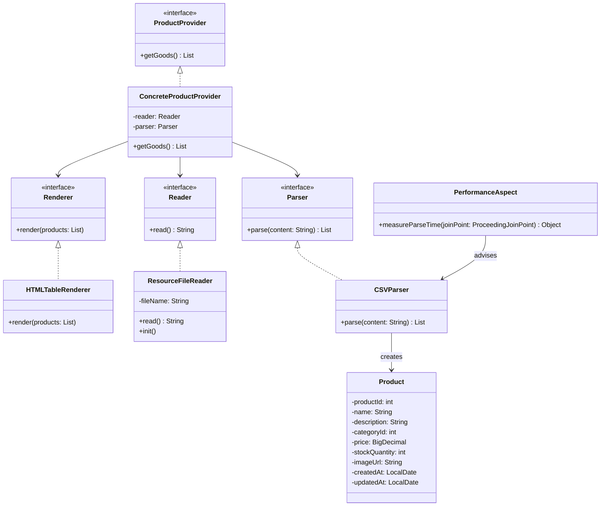

# Лабораторная работа 2 - Магазин зоотоваров с использованием Spring

## Описание проекта

Приложение читает данные из файла `products.csv`, парсит их в список объектов `Product` и генерирует файл `products.html` с таблицей продуктов. В консоль выводятся:
- Время инициализации бина `ResourceFileReader`
- Время выполнения парсинга CSV-файла, измеренное аспектом AOP

### Что генерирует и как

- **Входные данные:** Файл `products.csv` в `src/main/resources`, содержащий данные о продуктах (ID, название, описание, категория, цена, количество на складе, URL изображения, даты создания и обновления).
- **Процесс:**
  1. `ResourceFileReader` читает CSV-файл как строку, используя `@Value("${csv.filename}")` для получения имени файла из `application.properties`.
  2. `CSVParser` преобразует строку в список объектов `Product`.
  3. `ConcreteProductProvider` объединяет `Reader` и `Parser`, предоставляя данные для рендеринга.
  4. `HTMLTableRenderer` генерирует HTML-таблицу и записывает её в `products.html`.
  5. `PerformanceAspect` измеряет время выполнения метода `parse` в `CSVParser`.
- **Выходные данные:** 
  - Файл `products.html` с таблицей продуктов.
  - Консольные сообщения: время инициализации бина и время парсинга.

### Новый рендер HTML

`HTMLTableRenderer` заменил `ConsoleTableRenderer` из Лабораторной работы 1:
- **Логика:** Создаёт HTML-код с таблицей, используя `StringBuilder`. Для каждого продукта добавляется строка `<tr>` с ячейками `<td>` для всех атрибутов.
- **Вывод:** Записывает результат в файл `products.html` с помощью `FileWriter`.
- **Особенности:** Аннотация `@Primary` делает его предпочтительной реализацией интерфейса `Renderer`.
- **Пример вывода:**
  ```html
  <!DOCTYPE html><html><head><title>Productos</title></head><body>
  <table border='1'><tr><th>ID</th><th>Nombre</th><th>Descripción</th><th>Categoría</th><th>Precio</th><th>Stock</th><th>URL Imagen</th><th>Creado</th><th>Actualizado</th></tr>
  <tr><td>1</td><td>Корм</td><td>Для кошек</td><td>2</td><td>10.50</td><td>100</td><td>catfood.jpg</td><td>2023-01-01</td><td>2023-01-02</td></tr>
  </table></body></html>
  ```

## Изменения в проекте

### Проект был переработан по сравнению с Лабораторной работой 1:

- **Удаление AppConfig.java:** Конфигурация заменена на аннотации (@Component, @Autowired, @Value).
- **Добавление аннотаций:**
  - `@Component` для автоматического обнаружения бинов.
  - `@Value` для чтения имени файла из application.properties.
  - `@PostConstruct` для вывода времени инициализации.
  - `@Aspect` и `@Around` для AOP.
  - `@Primary` для выбора HTMLTableRenderer.
- **Новый рендер:** HTMLTableRenderer вместо ConsoleTableRenderer.
- **AOP:** Добавлен PerformanceAspect для измерения времени парсинга.
- **Spring Boot:** Использование @SpringBootApplication для запуска через gradle bootRun.
- **Удаление тестов:** Удалён устаревший AppTest.java, так как он ссылался на несуществующий метод getGreeting().

## Новая структура проекта

```
D:\Semetre 4\Java_C++\cad-2025\les04\lab\
├── app
│   ├── build.gradle.kts
│   └── src
│       ├── main
│       │   ├── java
│       │   │   └── ru
│       │   │       └── bsuedu
│       │   │           └── cad
│       │   │               └── lab
│       │   │                   ├── App.java
│       │   │                   ├── aspect
│       │   │                   │   └── PerformanceAspect.java
│       │   │                   ├── model
│       │   │                   │   └── Product.java
│       │   │                   ├── parser
│       │   │                   │   ├── CSVParser.java
│       │   │                   │   └── Parser.java
│       │   │                   ├── provider
│       │   │                   │   ├── ConcreteProductProvider.java
│       │   │                   │   └── ProductProvider.java
│       │   │                   ├── reader
│       │   │                   │   ├── Reader.java
│       │   │                   │   └── ResourceFileReader.java
│       │   │                   └── renderer
│       │   │                       ├── ConsoleTableRenderer.java
│       │   │                       ├── HTMLTableRenderer.java
│       │   │                       └── Renderer.java
│       │   └── resources
│       │       ├── application.properties
│       │       └── products.csv
│       └── test (пустая или удалена)
└── README.md
```

## Требования и запуск

### Требования:
- Java 17
- Gradle 8.x
- Зависимости: Spring Boot 3.2.3, Spring AOP, Jakarta Annotation API.

### Инструкции:
1. Перейдите в директорию:
   ```
   cd D:\Semetre 4\Java_C++\cad-2025\les04\lab
   ```
2. Убедитесь, что products.csv находится в src/main/resources.
3. Запустите:
   ```
   gradle bootRun
   ```
4. Проверьте консоль и откройте products.html.

## UML-диаграмма



## Контрольные вопросы

### 1. Виды конфигурирования ApplicationContext
- **XML-конфигурация:** Определение бинов в XML-файлах (устаревший способ).
- **Java-конфигурация:** Использование классов с @Configuration и методов @Bean (использовалась в Лабораторной 1).
- **Аннотационная конфигурация:** Автоматическое обнаружение бинов через @Component, @Service, и т.д. (применена здесь).

### 2. Стереотипные аннотации
- **@Component:** Базовая аннотация для бинов (например, ResourceFileReader).
- **@Service:** Для сервисного слоя, обрабатывающего бизнес-логику.
- **@Repository:** Для доступа к данным, работы с БД.
- **@Controller:** Для веб-контроллеров, обрабатывающих HTTP-запросы.
- **@Configuration:** Для классов, содержащих определения бинов (@Bean).

Использование: Указывают Spring, какие классы являются бинами для автоматического создания, также помогают разделить приложение на логические слои.

### 3. Инъекция зависимостей. Виды автоматического связывания
- **По конструктору:** `@Autowired` над конструктором (в ConcreteProductProvider).
  ```java
  @Component
  public class ConcreteProductProvider {
      @Autowired
      public ConcreteProductProvider(Reader reader, Parser parser) {
          this.reader = reader;
          this.parser = parser;
      }
  }
  ```
- **По сеттеру:** `@Autowired` над методом set.
  ```java
  @Component
  public class ConcreteProductProvider {
      private Reader reader;
      
      @Autowired
      public void setReader(Reader reader) {
          this.reader = reader;
      }
  }
  ```
- **По полю:** `@Autowired` над полем напрямую.
  ```java
  @Component
  public class ConcreteProductProvider {
      @Autowired
      private Reader reader;
  }
  ```

Конструктор предпочтителен для обязательных зависимостей и помогает создавать неизменяемые объекты, сеттер — для необязательных зависимостей, поля — для простоты (но снижает тестируемость).

### 4. Внедрение параметров. Простые параметры в бин
Простые параметры (строки, числа) внедряются через `@Value` из свойств:

```java
@Component
public class ResourceFileReader {
    @Value("${csv.filename}")
    private String fileName;
    
    // Также можно использовать значение по умолчанию:
    @Value("${csv.filename:products.csv}")
    private String fileNameWithDefault;
}
```

Источник значений - файл application.properties, переменные окружения или значения по умолчанию.

### 5. Внедрение параметров с помощью SpEL
SpEL (Spring Expression Language) позволяет вычислять выражения:

```java
// Доступ к системным свойствам
@Value("#{systemProperties['user.region']}")
private String region;

// Тернарный оператор
@Value("#{${csv.enabled} == true ? 'enabled' : 'disabled'}")
private String fileStatus;

// Математические операции
@Value("#{2 * 3 + 1}")
private int calculatedValue;

// Доступ к бинам и их методам
@Value("#{productService.getDefaultCategory()}")
private String defaultCategory;
```

SpEL позволяет выполнять сложные вычисления, условные операции и доступ к другим бинам при внедрении параметров.

### 6. Режимы получения бинов
- **Singleton (одиночка):** Один экземпляр на контекст (по умолчанию).
  ```java
  @Component
  @Scope("singleton")
  public class ProductService { }
  ```
  
- **Prototype (прототип):** Новый экземпляр при каждом запросе.
  ```java
  @Component
  @Scope("prototype")
  public class ShoppingCart { }
  ```
  
- **Request:** Один экземпляр на HTTP-запрос (для веб-приложений).
- **Session:** Один экземпляр на HTTP-сессию.
- **Application:** Один экземпляр на ServletContext (для всего веб-приложения).
- **WebSocket:** Один экземпляр на WebSocket.

Singleton подходит для сервисов и репозиториев, Prototype — для уникальных объектов типа корзины покупок.

### 7. Жизненный цикл бинов
1. **Создание:** Spring создаёт экземпляр бина.
2. **Инъекция зависимостей:** Внедряются все зависимости (через конструктор, сеттеры или поля).
3. **Инициализация:**
   - Вызывается метод с `@PostConstruct`
   - Выполняется метод `afterPropertiesSet()` (если бин реализует `InitializingBean`)
   - Выполняется кастомный метод инициализации (если задан)
4. **Использование:** Бин доступен для использования.
5. **Уничтожение:**
   - Вызывается метод с `@PreDestroy`
   - Выполняется метод `destroy()` (если бин реализует `DisposableBean`)
   - Выполняется кастомный метод уничтожения (если задан)

Пример:
```java
@Component
public class ResourceFileReader {
    @PostConstruct
    public void init() {
        System.out.println("ResourceFileReader initialized");
    }
    
    @PreDestroy
    public void cleanup() {
        System.out.println("ResourceFileReader being destroyed");
    }
}
```

### 8. Что такое АОП? Основные понятия AOP
**AOP (Aspect-Oriented Programming, Аспектно-ориентированное программирование)** - парадигма программирования, направленная на увеличение модульности за счёт разделения сквозной функциональности.

**Основные понятия:**
- **Aspect (Аспект):** Модуль, содержащий сквозную функциональность (логирование, безопасность, транзакции).
- **Join Point (Точка соединения):** Точка в выполнении программы, где может быть применен аспект (вызов метода, исключение).
- **Advice (Совет):** Действие, выполняемое аспектом в определенной точке соединения (before, after, around).
- **Pointcut (Срез):** Выражение, определяющее, к каким точкам соединения применяется аспект.
- **Target Object (Целевой объект):** Объект, к которому применяется аспект.
- **AOP Proxy (Прокси AOP):** Объект, созданный AOP-фреймворком для реализации аспектов.
- **Weaving (Переплетение):** Процесс связывания аспектов с целевыми объектами.

### 9. Типы АОП в Spring
- **Spring AOP:** Реализация AOP на основе прокси, ограниченная методами Spring-бинов.
- **AspectJ:** Полноценная реализация AOP с поддержкой всех типов join points.

Spring поддерживает два способа интеграции:
1. **Spring AOP:** Простая реализация через прокси.
2. **Spring + AspectJ:** Более мощная комбинация, включающая AspectJ weaving.

### 10. Виды Advice
- **@Before:** Выполняется до метода.
  ```java
  @Before("execution(* ru.bsuedu.cad.lab.parser.CSVParser.parse(..))")
  public void logBeforeParsing() {
      System.out.println("About to parse CSV");
  }
  ```
  
- **@After:** Выполняется после метода (независимо от результата).
  ```java
  @After("execution(* ru.bsuedu.cad.lab.parser.CSVParser.parse(..))")
  public void logAfterParsing() {
      System.out.println("Parse method completed");
  }
  ```
  
- **@AfterReturning:** Выполняется после успешного завершения метода.
  ```java
  @AfterReturning(
      pointcut = "execution(* ru.bsuedu.cad.lab.parser.CSVParser.parse(..))",
      returning = "result")
  public void logAfterSuccess(Object result) {
      System.out.println("Parse completed with " + ((List)result).size() + " items");
  }
  ```
  
- **@AfterThrowing:** Выполняется если метод выбросил исключение.
  ```java
  @AfterThrowing(
      pointcut = "execution(* ru.bsuedu.cad.lab.parser.CSVParser.parse(..))",
      throwing = "ex")
  public void logAfterException(Exception ex) {
      System.out.println("Parse failed: " + ex.getMessage());
  }
  ```
  
- **@Around:** Обертывает метод, может менять параметры, результат, перехватывать исключения.
  ```java
  @Around("execution(* ru.bsuedu.cad.lab.parser.CSVParser.parse(..))")
  public Object measurePerformance(ProceedingJoinPoint joinPoint) throws Throwable {
      long start = System.currentTimeMillis();
      Object result = joinPoint.proceed();
      long end = System.currentTimeMillis();
      System.out.println("Parse took " + (end - start) + " ms");
      return result;
  }
  ```

### 11. Виды Point Cut
- **execution:** Сопоставляет с выполнением методов.
  ```java
  @Pointcut("execution(* ru.bsuedu.cad.lab.parser.*.*(..))")
  public void allParserMethods() {}
  ```
  
- **within:** Сопоставляет с методами в определенном пакете или классе.
  ```java
  @Pointcut("within(ru.bsuedu.cad.lab.parser.*)")
  public void allParserClassMethods() {}
  ```
  
- **this:** Сопоставляет с бинами, которые являются экземплярами указанного типа.
  ```java
  @Pointcut("this(ru.bsuedu.cad.lab.parser.Parser)")
  public void allParserImplementations() {}
  ```
  
- **target:** Сопоставляет с целевыми объектами, которые являются экземплярами указанного типа.
  ```java
  @Pointcut("target(ru.bsuedu.cad.lab.parser.Parser)")
  public void allParserImplTargets() {}
  ```
  
- **args:** Сопоставляет с методами с определенными аргументами.
  ```java
  @Pointcut("args(java.lang.String)")
  public void methodsWithStringArg() {}
  ```
  
- **@annotation:** Сопоставляет с методами, помеченными определенной аннотацией.
  ```java
  @Pointcut("@annotation(org.springframework.transaction.annotation.Transactional)")
  public void transactionalMethods() {}
  ```

### 12. Чем Spring AOP отличается от AspectJ

**Spring AOP:**
- Основан на прокси (JDK dynamic proxies для интерфейсов, CGLIB для классов).
- Поддерживает только точки соединения на уровне методов.
- Работает только с Spring-бинами.
- Проще в использовании, не требует дополнительных инструментов.
- Интегрирован с Spring, не требует отдельного компилятора.
- Меньшая производительность при большом количестве аспектов.

**AspectJ:**
- Полноценная реализация AOP, использует weaving (compile-time, post-compile, или load-time).
- Поддерживает все типы точек соединения (методы, конструкторы, поля, статические инициализаторы).
- Может работать с любыми Java-объектами, не только Spring-бинами.
- Требует AspectJ компилятор или агент для load-time weaving.
- Лучшая производительность, особенно при большом количестве аспектов.
- Более сложный в настройке и использовании.
