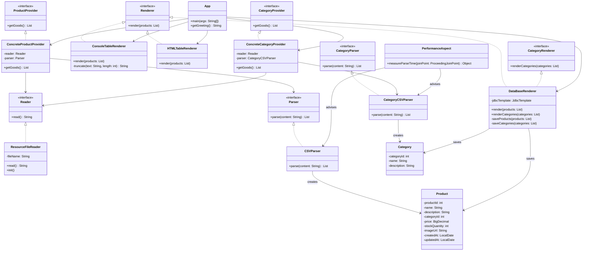

# Лабораторная работа 3 - Магазин зоотоваров с использованием Spring и JDBC

## Описание проекта

Приложение читает данные из файлов `products.csv` и `category.csv`, парсит их в списки объектов `Product` и `Category`, y realiza las siguientes acciones:
- Генерирует файл `products.html` с таблицей продуктов используя `HTMLTableRenderer`.
- Выводит таблицу продуктов в консоль с помощью `ConsoleTableRenderer`.
- Сохраняет продукты и категории в базу данных H2 в памяти с использованием `DataBaseRenderer` и JDBC.
- Показывает в консоли:
  - Время инициализации бина `ResourceFileReader`.
  - Время выполнения парсинга CSV-файлов, измеренное аспектом AOP.

### Что генерирует и как

- **Входные данные:**
  - `products.csv` в `src/main/resources`, содержащий данные о продуктах (ID, название, описание, категория, цена, количество на складе, URL изображения, даты создания и обновления).
  - `category.csv` в `src/main/resources`, содержащий данные о категориях (ID, название, описание).
- **Процесс:**
  1. `ResourceFileReader` читает оба CSV-файла как строки, используя `@Value("${csv.filename}")` и `@Value("${category.csv.filename}")` из `application.properties`.
  2. `CSVParser` преобразует `products.csv` в список объектов `Product`.
  3. `CategoryCSVParser` преобразует `category.csv` в список объектов `Category`.
  4. `ConcreteProductProvider` и `ConcreteCategoryProvider` объединяют `Reader` и соответствующие парсеры, предоставляя данные для рендеринга.
  5. `ConsoleTableRenderer` выводит таблицу продуктов в консоль.
  6. `HTMLTableRenderer` генерирует HTML-таблицу и записывает её в `products.html`.
  7. `DataBaseRenderer` сохраняет категории и продукты в базу данных H2, используя `JdbcTemplate` для выполнения SQL-запросов.
  8. `PerformanceAspect` измеряет время выполнения методов `parse` в `CSVParser` и `CategoryCSVParser`.
- **Выходные данные:**
  - Файл `products.html` с таблицей продуктов.
  - Таблица продуктов в консоли.
  - Данные о продуктах и категориях в базе данных H2 в памяти.
  - Консольные сообщения: время инициализации бинов и время парсинга.

### Новый рендер для базы данных

`DataBaseRenderer` добавлен как новая реализация интерфейсов `Renderer` и `CategoryRenderer`:
- **Логика:** Использует `JdbcTemplate` для выполнения SQL-запросов `INSERT INTO` для сохранения категорий и продуктов в таблицы `CATEGORIES` и `PRODUCTS`. Сначала сохраняются категории, затем продукты, чтобы соблюсти ограничение внешнего ключа.
- **Вывод:** Сообщения в консоли, такие как `"Guardando X categorías..."` и `"Guardando Y productos..."`.
- **Особенности:** Аннотация `@Component` делает его бином Spring, и он интегрирован с H2 через конфигурацию `DatabaseConfig`.
- **Пример вывода в консоли:**
```bash
=== Iniciando renderizado de categorías en la base de datos ===
Guardando 10 categorías...
Categorías guardadas exitosamente.
=== Iniciando renderizado de productos en la base de datos ===
Guardando 10 productos...
Productos guardados exitosamente.
```


## Изменения в проекте

### Проект был расширен по сравнению с Лабораторной работой 2:

- **Добавление работы с базой данных:**
- Новые зависимости: `org.springframework.boot:spring-boot-starter-jdbc` и `com.h2database:h2` в `build.gradle`.
- Файл `schema.sql` в `src/main/resources` для создания таблиц `CATEGORIES` и `PRODUCTS` с ограничением внешнего ключа.
- Класс `DatabaseConfig` с `@Bean` для настройки `DataSource` (H2 в памяти).
- **Новые классы и интерфейсы:**
- `CategoryRenderer` (интерфейс) и `DataBaseRenderer` для работы с категориями и продуктами в базе данных.
- `Category` (модель данных для категорий).
- `CategoryCSVParser` и `ConcreteCategoryProvider` для чтения и предоставления категорий из `category.csv`.
- **Модификация App.java:** Теперь вызывает все три рендера (`ConsoleTableRenderer`, `HTMLTableRenderer`, `DataBaseRenderer`), включая предварительное сохранение категорий для `DataBaseRenderer`.
- **Добавление аннотаций:**
- `@Component` для `ConsoleTableRenderer`, чтобы он стал бином Spring.
- `@Primary` опционально используется для управления выбором рендера (в данном случае не обязательно, так как рендеры вызываются явно).
- **Конфигурация:**
- В `application.properties` добавлено `category.csv.filename=category.csv` и `spring.sql.init.mode=never` для отключения автозапуска SQL-скриптов Spring Boot.
- **AOP:** `PerformanceAspect` теперь измеряет время парсинга как для продуктов, так и для категорий.

## Новая структура проекта

```bash
├── app
│   ├── build.gradle.kts
│   └── src
│       ├── main
│       │   ├── java
│       │   │   └── ru
│       │   │       └── bsuedu
│       │   │           └── cad
│       │   │               └── lab
│       │   │                   ├── App.java
│       │   │                   ├── aspect
│       │   │                   │   └── PerformanceAspect.java
│       │   │                   ├── config
│       │   │                   │   └── DatabaseConfig.java
│       │   │                   ├── model
│       │   │                   │   ├── Product.java
│       │   │                   │   └── Category.java
│       │   │                   ├── parser
│       │   │                   │   ├── CSVParser.java
│       │   │                   │   ├── CategoryCSVParser.java
│       │   │                   │   ├── Parser.java
│       │   │                   │   └── CategoryParser.java
│       │   │                   ├── provider
│       │   │                   │   ├── ConcreteProductProvider.java
│       │   │                   │   ├── ConcreteCategoryProvider.java
│       │   │                   │   ├── ProductProvider.java
│       │   │                   │   └── CategoryProvider.java
│       │   │                   ├── reader
│       │   │                   │   ├── Reader.java
│       │   │                   │   └── ResourceFileReader.java
│       │   │                   └── renderer
│       │   │                       ├── Renderer.java
│       │   │                       ├── CategoryRenderer.java
│       │   │                       ├── ConsoleTableRenderer.java
│       │   │                       ├── HTMLTableRenderer.java
│       │   │                       └── DataBaseRenderer.java
│       │   └── resources
│       │       ├── application.properties
│       │       ├── products.csv
│       │       ├── category.csv
│       │       └── schema.sql
│       └── test (пустая или удалена)
└── README.md
```

## Требования и запуск

### Требования:
- Java 17
- Gradle 8.x
- Зависимости: 
  - `org.springframework.boot:spring-boot-starter` (Spring Boot 3.2.3)
  - `org.springframework.boot:spring-boot-starter-jdbc`
  - `com.h2database:h2`
  - `org.springframework:spring-aspects` (для AOP)
  - `jakarta.annotation:jakarta.annotation-api`

### Инструкции:
1. Перейдите в директорию:

2. Убедитесь, что `products.csv`, `category.csv` и `schema.sql` находятся в `src/main/resources`.
3. Запустите:
```bash
gradle bootRun
```

4. Проверьте консоль (таблицу продуктов и сообщения о рендеринге), откройте `products.html` и убедитесь, что данные сохранены в базе данных H2 (в памяти).

### Пример запуска:
```bash
... (логи Spring Boot) ...
Bean ResourceFileReader inicializado el: Thu Mar 13 13:34:21 COT 2025
=== Renderizando categorías (DataBaseRenderer) ===
=== Iniciando renderizado de categorías en la base de datos ===
Guardando 10 categorías...
Categorías guardadas exitosamente.
=== Renderizando productos con los tres renderers ===
+----+----------------------+-------------------------+-----------+---------+-------+--------------------------------+------------+------------+
| ID | Nombre               | Descripcion            | Categoria | Precio  | Stock | URL Imagen                     | Creado     | Actualizado |
| 1  | Dry dog food         | Complete food for adul... | 1         | 1500,00 | 50    | https://example.com/dog_foo... | 2025-01-15 | 2025-02-01 |
... (остальные продукты) ...
Tiempo de parseo del CSV: 1 ms
=== Iniciando renderizado de productos en la base de datos ===
Guardando 10 productos...
Productos guardados exitosamente.
Tabla HTML generada en products.html
BUILD SUCCESSFUL in 3s
```


## UML-диаграмма



## Контрольные вопросы
# Spring JDBC: Полное руководство

## 1. Что такое Spring JDBC и какие преимущества оно предоставляет по сравнению с традиционным JDBC?

Spring JDBC — это абстракция над стандартным JDBC API, которая упрощает взаимодействие с базами данных в Java-приложениях. 

**Преимущества Spring JDBC:**

- **Устраняет шаблонный код**: Автоматизирует открытие/закрытие соединений, подготовку и выполнение запросов, обработку результатов.
- **Централизованная обработка исключений**: Преобразует JDBC-специфичные проверяемые исключения в более понятные непроверяемые исключения Spring.
- **Шаблоны и утилиты**: Предоставляет классы-шаблоны, упрощающие типовые операции с БД.
- **Декларативное управление транзакциями**: Легко интегрируется с транзакционной инфраструктурой Spring.
- **Интеграция с IoC-контейнером**: Позволяет инжектировать компоненты доступа к данным в другие бины.
- **Меньше кода**: Позволяет достичь той же функциональности меньшим количеством строк кода.

## 2. Какой основной класс в Spring используется для работы с базой данных через JDBC?

Основным классом для работы с базой данных в Spring JDBC является `JdbcTemplate`. Это центральный класс, который инкапсулирует основные низкоуровневые функции JDBC и предоставляет удобный интерфейс для выполнения SQL-запросов.

## 3. Какие шаги необходимо выполнить для настройки JDBC в Spring-приложении?

### Шаги настройки Spring JDBC:

1. **Добавить необходимые зависимости**:
   ```xml
   <!-- Для Maven -->
   <dependency>
       <groupId>org.springframework</groupId>
       <artifactId>spring-jdbc</artifactId>
       <version>{версия-spring}</version>
   </dependency>
   <dependency>
       <groupId>org.springframework</groupId>
       <artifactId>spring-context</artifactId>
       <version>{версия-spring}</version>
   </dependency>
   <dependency>
       <groupId>{группа-драйвера-бд}</groupId>
       <artifactId>{артефакт-драйвера-бд}</artifactId>
       <version>{версия-драйвера}</version>
   </dependency>
   ```

2. **Настроить источник данных (DataSource)**:

   Java-конфигурация:
   ```java
   @Configuration
   public class DatabaseConfig {
       
       @Bean
       public DataSource dataSource() {
           DriverManagerDataSource dataSource = new DriverManagerDataSource();
           dataSource.setDriverClassName("com.mysql.cj.jdbc.Driver");
           dataSource.setUrl("jdbc:mysql://localhost:3306/mydb");
           dataSource.setUsername("username");
           dataSource.setPassword("password");
           return dataSource;
       }
   }
   ```

   XML-конфигурация:
   ```xml
   <bean id="dataSource" class="org.springframework.jdbc.datasource.DriverManagerDataSource">
       <property name="driverClassName" value="com.mysql.cj.jdbc.Driver" />
       <property name="url" value="jdbc:mysql://localhost:3306/mydb" />
       <property name="username" value="username" />
       <property name="password" value="password" />
   </bean>
   ```

3. **Создать экземпляр JdbcTemplate**:

   Java-конфигурация:
   ```java
   @Configuration
   public class DatabaseConfig {
       
       @Bean
       public JdbcTemplate jdbcTemplate(DataSource dataSource) {
           return new JdbcTemplate(dataSource);
       }
   }
   ```

   XML-конфигурация:
   ```xml
   <bean id="jdbcTemplate" class="org.springframework.jdbc.core.JdbcTemplate">
       <property name="dataSource" ref="dataSource" />
   </bean>
   ```

4. **Опционально: настроить транзакционный менеджер**:

   Java-конфигурация:
   ```java
   @Configuration
   @EnableTransactionManagement
   public class DatabaseConfig {
       
       @Bean
       public PlatformTransactionManager transactionManager(DataSource dataSource) {
           return new DataSourceTransactionManager(dataSource);
       }
   }
   ```

   XML-конфигурация:
   ```xml
   <bean id="transactionManager" class="org.springframework.jdbc.datasource.DataSourceTransactionManager">
       <property name="dataSource" ref="dataSource" />
   </bean>
   ```

## 4. Что такое JdbcTemplate и какие основные методы он предоставляет?

`JdbcTemplate` — это основной класс Spring JDBC, который упрощает использование JDBC, автоматизируя рутинные задачи и обработку ошибок.

### Основные методы JdbcTemplate:

#### Для выполнения запросов без возврата значений:
- `execute(String sql)` — выполняет произвольный SQL-запрос
- `update(String sql, Object... args)` — выполняет SQL-запрос (INSERT, UPDATE, DELETE) с параметрами
- `batchUpdate(String... sql)` — выполняет пакет SQL-запросов одним вызовом

#### Для выполнения запросов с возвратом значений:
- `queryForObject(String sql, Class<T> requiredType)` — для получения одного значения
- `queryForObject(String sql, RowMapper<T> rowMapper)` — для получения одной записи, преобразованной в объект
- `query(String sql, RowMapper<T> rowMapper)` — для получения списка объектов
- `queryForList(String sql, Class<T> elementType)` — для получения списка значений примитивных типов
- `queryForMap(String sql)` — для получения результата в виде Map

#### Для выполнения операций в рамках подготовленных выражений:
- `query(PreparedStatementCreator psc, RowMapper<T> rowMapper)`
- `update(PreparedStatementCreator psc)`
- `execute(PreparedStatementCreator psc, PreparedStatementCallback<T> action)`

## 5. Как в Spring JDBC выполнить запрос на выборку данных (SELECT) и получить результат в виде объекта?

В Spring JDBC для выборки данных и преобразования их в объекты чаще всего используются два подхода:

### 1. Использование RowMapper:

```java
// Предположим, что есть класс User
public class User {
    private Long id;
    private String username;
    private String email;
    
    // Конструкторы, геттеры, сеттеры
}

// Для получения одного объекта
public User getUserById(Long id) {
    String sql = "SELECT id, username, email FROM users WHERE id = ?";
    
    return jdbcTemplate.queryForObject(sql, new Object[]{id}, new RowMapper<User>() {
        @Override
        public User mapRow(ResultSet rs, int rowNum) throws SQLException {
            User user = new User();
            user.setId(rs.getLong("id"));
            user.setUsername(rs.getString("username"));
            user.setEmail(rs.getString("email"));
            return user;
        }
    });
}

// С использованием лямбда-выражения (Java 8+)
public User getUserById(Long id) {
    String sql = "SELECT id, username, email FROM users WHERE id = ?";
    
    return jdbcTemplate.queryForObject(sql, new Object[]{id},
        (rs, rowNum) -> {
            User user = new User();
            user.setId(rs.getLong("id"));
            user.setUsername(rs.getString("username"));
            user.setEmail(rs.getString("email"));
            return user;
        }
    );
}

// Для получения списка объектов
public List<User> getAllUsers() {
    String sql = "SELECT id, username, email FROM users";
    
    return jdbcTemplate.query(sql, (rs, rowNum) -> {
        User user = new User();
        user.setId(rs.getLong("id"));
        user.setUsername(rs.getString("username"));
        user.setEmail(rs.getString("email"));
        return user;
    });
}
```

### 2. Использование BeanPropertyRowMapper:

```java
// Для автоматического маппинга на объект (поля класса должны соответствовать названиям столбцов)
public User getUserById(Long id) {
    String sql = "SELECT id, username, email FROM users WHERE id = ?";
    
    return jdbcTemplate.queryForObject(
        sql, 
        new Object[]{id}, 
        new BeanPropertyRowMapper<>(User.class)
    );
}

// Для получения списка объектов
public List<User> getAllUsers() {
    String sql = "SELECT id, username, email FROM users";
    
    return jdbcTemplate.query(sql, new BeanPropertyRowMapper<>(User.class));
}
```

## 6. Как использовать RowMapper в JdbcTemplate?

`RowMapper` — это интерфейс, который преобразует строку результата запроса (ResultSet) в объект нужного типа.

### Способы использования RowMapper:

#### 1. Анонимный класс:

```java
List<Product> products = jdbcTemplate.query(
    "SELECT id, name, price FROM products",
    new RowMapper<Product>() {
        @Override
        public Product mapRow(ResultSet rs, int rowNum) throws SQLException {
            Product product = new Product();
            product.setId(rs.getLong("id"));
            product.setName(rs.getString("name"));
            product.setPrice(rs.getBigDecimal("price"));
            return product;
        }
    }
);
```

#### 2. Лямбда-выражение (Java 8+):

```java
List<Product> products = jdbcTemplate.query(
    "SELECT id, name, price FROM products",
    (rs, rowNum) -> {
        Product product = new Product();
        product.setId(rs.getLong("id"));
        product.setName(rs.getString("name"));
        product.setPrice(rs.getBigDecimal("price"));
        return product;
    }
);
```

#### 3. Выделение в отдельный класс:

```java
public class ProductRowMapper implements RowMapper<Product> {
    @Override
    public Product mapRow(ResultSet rs, int rowNum) throws SQLException {
        Product product = new Product();
        product.setId(rs.getLong("id"));
        product.setName(rs.getString("name"));
        product.setPrice(rs.getBigDecimal("price"));
        return product;
    }
}

// Использование
List<Product> products = jdbcTemplate.query(
    "SELECT id, name, price FROM products",
    new ProductRowMapper()
);
```

#### 4. Использование BeanPropertyRowMapper:

```java
// Автоматически сопоставляет столбцы с полями объекта по названию
List<Product> products = jdbcTemplate.query(
    "SELECT id, name, price FROM products",
    new BeanPropertyRowMapper<>(Product.class)
);
```

## 7. Как выполнить вставку (INSERT) данных в базу с использованием JdbcTemplate?

Существует несколько способов выполнить INSERT-запрос с помощью JdbcTemplate:

### 1. Метод update() с параметрами:

```java
public void addProduct(Product product) {
    String sql = "INSERT INTO products (name, price, description) VALUES (?, ?, ?)";
    
    jdbcTemplate.update(sql, 
        product.getName(),
        product.getPrice(),
        product.getDescription()
    );
}
```

### 2. С получением сгенерированного ключа:

```java
public Long addProductAndGetId(Product product) {
    String sql = "INSERT INTO products (name, price, description) VALUES (?, ?, ?)";
    
    KeyHolder keyHolder = new GeneratedKeyHolder();
    
    jdbcTemplate.update(connection -> {
        PreparedStatement ps = connection.prepareStatement(sql, new String[]{"id"});
        ps.setString(1, product.getName());
        ps.setBigDecimal(2, product.getPrice());
        ps.setString(3, product.getDescription());
        return ps;
    }, keyHolder);
    
    return keyHolder.getKey().longValue();
}
```

### 3. Использование SimpleJdbcInsert для более декларативного подхода:

```java
public Long addProduct(Product product) {
    SimpleJdbcInsert inserter = new SimpleJdbcInsert(jdbcTemplate)
        .withTableName("products")
        .usingGeneratedKeyColumns("id");
    
    Map<String, Object> parameters = new HashMap<>();
    parameters.put("name", product.getName());
    parameters.put("price", product.getPrice());
    parameters.put("description", product.getDescription());
    
    return inserter.executeAndReturnKey(parameters).longValue();
}
```

### 4. Batch-вставка для добавления множества записей:

```java
public void addProducts(List<Product> products) {
    String sql = "INSERT INTO products (name, price, description) VALUES (?, ?, ?)";
    
    jdbcTemplate.batchUpdate(sql, new BatchPreparedStatementSetter() {
        @Override
        public void setValues(PreparedStatement ps, int i) throws SQLException {
            Product product = products.get(i);
            ps.setString(1, product.getName());
            ps.setBigDecimal(2, product.getPrice());
            ps.setString(3, product.getDescription());
        }
        
        @Override
        public int getBatchSize() {
            return products.size();
        }
    });
}
```

## 8. Как выполнить обновление (UPDATE) или удаление (DELETE) записей через JdbcTemplate?

### Выполнение UPDATE-запроса:

```java
public void updateProduct(Product product) {
    String sql = "UPDATE products SET name = ?, price = ?, description = ? WHERE id = ?";
    
    jdbcTemplate.update(sql,
        product.getName(),
        product.getPrice(),
        product.getDescription(),
        product.getId()
    );
}

// Другой вариант с возвратом количества обновленных строк
public int updateProductPrice(Long id, BigDecimal newPrice) {
    String sql = "UPDATE products SET price = ? WHERE id = ?";
    
    return jdbcTemplate.update(sql, newPrice, id);
}
```

### Выполнение DELETE-запроса:

```java
public void deleteProduct(Long id) {
    String sql = "DELETE FROM products WHERE id = ?";
    
    jdbcTemplate.update(sql, id);
}

// С возвратом количества удаленных строк
public int deleteProductsByCategory(String category) {
    String sql = "DELETE FROM products WHERE category = ?";
    
    return jdbcTemplate.update(sql, category);
}
```

### Выполнение массового обновления или удаления:

```java
public int[] updateProductPrices(Map<Long, BigDecimal> priceUpdates) {
    String sql = "UPDATE products SET price = ? WHERE id = ?";
    
    List<Object[]> batchArgs = new ArrayList<>();
    
    for (Map.Entry<Long, BigDecimal> entry : priceUpdates.entrySet()) {
        Object[] values = {entry.getValue(), entry.getKey()};
        batchArgs.add(values);
    }
    
    return jdbcTemplate.batchUpdate(sql, batchArgs);
}
```

## 9. Как в Spring JDBC обрабатывать исключения, возникающие при работе с базой данных?

Spring JDBC использует иерархию исключений, которая упрощает обработку ошибок, возникающих при работе с базой данных.

### Основные особенности обработки исключений в Spring JDBC:

1. **Преобразование исключений**: Spring JDBC автоматически преобразует проверяемые (checked) JDBC-исключения в непроверяемые (unchecked) исключения из иерархии `DataAccessException`.

2. **Иерархия исключений**: Все исключения в Spring JDBC являются подклассами `DataAccessException`, что упрощает обработку различных типов ошибок.

### Пример обработки исключений:

```java
public void updateProductWithExceptionHandling(Product product) {
    try {
        String sql = "UPDATE products SET name = ?, price = ? WHERE id = ?";
        jdbcTemplate.update(sql, product.getName(), product.getPrice(), product.getId());
    } catch (DuplicateKeyException e) {
        // Обработка нарушения уникальности ключа
        logger.error("Продукт с таким наименованием уже существует", e);
        throw new ProductAlreadyExistsException("Продукт с наименованием " + product.getName() + " уже существует", e);
    } catch (DataIntegrityViolationException e) {
        // Обработка нарушения целостности данных
        logger.error("Ошибка целостности данных при обновлении продукта", e);
        throw new ProductValidationException("Невозможно обновить продукт из-за ошибки в данных", e);
    } catch (CannotGetJdbcConnectionException e) {
        // Обработка проблем с соединением с БД
        logger.error("Не удалось установить соединение с базой данных", e);
        throw new DatabaseConnectionException("Проблемы с подключением к базе данных", e);
    } catch (DataAccessException e) {
        // Обработка других ошибок доступа к данным
        logger.error("Ошибка при обновлении продукта", e);
        throw new DatabaseOperationException("Ошибка выполнения операции с базой данных", e);
    }
}
```

### Основные типы исключений в Spring JDBC:

- `BadSqlGrammarException` — ошибки в SQL-синтаксисе
- `DataIntegrityViolationException` — нарушение целостности данных
- `DuplicateKeyException` — нарушение уникальности ключа
- `DataAccessResourceFailureException` — ошибки ресурсов доступа к данным
- `CannotGetJdbcConnectionException` — проблемы с соединением с БД
- `QueryTimeoutException` — превышение времени выполнения запроса

### Пользовательская обработка SQL-ошибок:

```java
// Создание собственного обработчика SQL-ошибок
public class CustomSQLExceptionTranslator extends SQLErrorCodeSQLExceptionTranslator {
    @Override
    protected DataAccessException customTranslate(String task, String sql, SQLException sqlEx) {
        if (sqlEx.getErrorCode() == 12345) {  // Собственный код ошибки
            return new CustomDataAccessException("Пользовательская ошибка базы данных", sqlEx);
        }
        return super.customTranslate(task, sql, sqlEx);
    }
}

// Применение собственного обработчика
@Bean
public JdbcTemplate jdbcTemplate(DataSource dataSource) {
    JdbcTemplate jdbcTemplate = new JdbcTemplate(dataSource);
    jdbcTemplate.setExceptionTranslator(new CustomSQLExceptionTranslator());
    return jdbcTemplate;
}
```

## 10. Какие альтернативные способы работы с базой данных есть в Spring кроме JdbcTemplate?

Spring предлагает несколько альтернативных способов работы с базами данных:

### 1. NamedParameterJdbcTemplate

Расширение JdbcTemplate, позволяющее использовать именованные параметры вместо знаков "?".

```java
public List<Product> findByCategory(String category, BigDecimal minPrice) {
    String sql = "SELECT * FROM products WHERE category = :category AND price > :minPrice";
    
    MapSqlParameterSource params = new MapSqlParameterSource();
    params.addValue("category", category);
    params.addValue("minPrice", minPrice);
    
    return namedParameterJdbcTemplate.query(sql, params, new BeanPropertyRowMapper<>(Product.class));
}

// Альтернативный вариант с Map
public Product findById(Long id) {
    String sql = "SELECT * FROM products WHERE id = :id";
    
    Map<String, Object> params = new HashMap<>();
    params.put("id", id);
    
    return namedParameterJdbcTemplate.queryForObject(sql, params, new BeanPropertyRowMapper<>(Product.class));
}
```

### 2. SimpleJdbcInsert и SimpleJdbcCall

Высокоуровневые абстракции для вставки данных и вызова хранимых процедур.

```java
// SimpleJdbcInsert
public Long saveProduct(Product product) {
    SimpleJdbcInsert inserter = new SimpleJdbcInsert(jdbcTemplate)
        .withTableName("products")
        .usingGeneratedKeyColumns("id");
    
    Map<String, Object> params = new HashMap<>();
    params.put("name", product.getName());
    params.put("price", product.getPrice());
    params.put("category", product.getCategory());
    
    return inserter.executeAndReturnKey(params).longValue();
}

// SimpleJdbcCall
public Product getProductDetails(Long id) {
    SimpleJdbcCall jdbcCall = new SimpleJdbcCall(jdbcTemplate)
        .withProcedureName("get_product_details")
        .returningResultSet("product", new BeanPropertyRowMapper<>(Product.class));
    
    MapSqlParameterSource params = new MapSqlParameterSource()
        .addValue("product_id", id);
    
    Map<String, Object> result = jdbcCall.execute(params);
    List<Product> products = (List<Product>) result.get("product");
    
    return products.get(0);
}
```

### 3. Spring Data JDBC

Высокоуровневая абстракция над JDBC, следующая концепциям DDD (Domain-Driven Design).

```java
// Определение репозитория
public interface ProductRepository extends CrudRepository<Product, Long> {
    List<Product> findByCategory(String category);
    List<Product> findByPriceGreaterThan(BigDecimal price);
}

// Использование репозитория
@Service
public class ProductService {
    private final ProductRepository productRepository;
    
    public ProductService(ProductRepository productRepository) {
        this.productRepository = productRepository;
    }
    
    public Product findById(Long id) {
        return productRepository.findById(id).orElseThrow(() -> new ProductNotFoundException(id));
    }
    
    public List<Product> findByCategory(String category) {
        return productRepository.findByCategory(category);
    }
}
```

### 4. Spring Data JPA

ORM-фреймворк, основанный на JPA (Java Persistence API), предоставляющий более высокоуровневую абстракцию.

```java
// Сущность
@Entity
@Table(name = "products")
public class Product {
    @Id
    @GeneratedValue(strategy = GenerationType.IDENTITY)
    private Long id;
    
    private String name;
    
    private BigDecimal price;
    
    @ManyToOne
    @JoinColumn(name = "category_id")
    private Category category;
    
    // Геттеры, сеттеры
}

// Репозиторий
public interface ProductRepository extends JpaRepository<Product, Long> {
    List<Product> findByCategory_Name(String categoryName);
    
    @Query("SELECT p FROM Product p WHERE p.price BETWEEN :min AND :max")
    List<Product> findByPriceRange(BigDecimal min, BigDecimal max);
}
```

### 5. MyBatis-Spring

Интеграция с MyBatis, предоставляющая альтернативный способ SQL-маппинга.

```java
// Маппер
@Mapper
public interface ProductMapper {
    @Select("SELECT * FROM products WHERE id = #{id}")
    Product findById(Long id);
    
    @Insert("INSERT INTO products (name, price, category) VALUES (#{name}, #{price}, #{category})")
    @Options(useGeneratedKeys = true, keyProperty = "id")
    void insert(Product product);
}

// Использование
@Service
public class ProductService {
    private final ProductMapper productMapper;
    
    public ProductService(ProductMapper productMapper) {
        this.productMapper = productMapper;
    }
    
    public Product findById(Long id) {
        return productMapper.findById(id);
    }
}
```

### 6. Hibernate с интеграцией Spring

Использование Hibernate (одной из реализаций JPA) напрямую с интеграцией Spring.

```java
@Repository
public class ProductDaoImpl implements ProductDao {
    
    private final SessionFactory sessionFactory;
    
    public ProductDaoImpl(SessionFactory sessionFactory) {
        this.sessionFactory = sessionFactory;
    }
    
    @Override
    public Product findById(Long id) {
        Session session = sessionFactory.getCurrentSession();
        return session.get(Product.class, id);
    }
    
    @Override
    public List<Product> findByCategory(String category) {
        Session session = sessionFactory.getCurrentSession();
        return session.createQuery("from Product p where p.category.name = :category", Product.class)
            .setParameter("category", category)
            .getResultList();
    }
}
```

